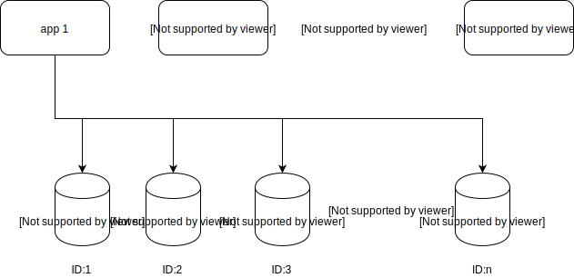

# 动机

希望可以有一个容易部署，容易维护，原理简单（意味着不容易出问题），且性能还不错的**分布式ID解决方案**，没错，是**方案**，而不是方法。

# ID组成

|sign|sequence|work id|
|----|----|----|
|1 bit|53 bit|10 bit|

+ sign:固定1bit符号标识，即生成的UID为正数。
+ sequence:2^53个取值，9007199254740992

# 架构图



底层可以使用MySQL或者Redis，client端需要一个配置文件，如：

```
{
  "type": "Redis",
  "providers": [
    {
      "id": 1,
      "url": "redis://127.0.0.1:6379/0",
      "namespace": "id_1"
    },
    {
      "id": 2,
      "url": "redis://127.0.0.1:6379/0",
      "namespace": "id_2"
    },
    {
      "id": 3,
      "url": "redis://127.0.0.1:6379/0",
      "namespace": "id_3"
    }
  ],
  "bufferSize": 1000,
  "idleSize": 10,
  "timeout": 10,
  "checkInterval": 10
}
```

```
{
  "type": "MySQL",
  "providers": [
    {
      "id": 1,
      "url": "jdbc:mysql://localhost:3306/light_id?useSSL=false&serverTimezone=UTC&allowPublicKeyRetrieval=true&connectTimeout=60000&socketTimeout=100",
      "namespace": "id_1",
      "options": {
        "username": "root",
        "password": "123456"
      }
    },
    {
      "id": 2,
      "url": "jdbc:mysql://localhost:3306/light_id?useSSL=false&serverTimezone=UTC&allowPublicKeyRetrieval=true&connectTimeout=60000&socketTimeout=100",
      "namespace": "id_2",
      "options": {
        "username": "root",
        "password": "123456"
      }
    },
    {
      "id": 3,
      "url": "jdbc:mysql://localhost:3306/light_id?useSSL=false&serverTimezone=UTC&allowPublicKeyRetrieval=true&connectTimeout=60000&socketTimeout=100",
      "namespace": "id_3",
      "options": {
        "username": "root",
        "password": "123456"
      }
    }
  ],
  "bufferSize": 100,
  "idleSize": 10,
  "timeout": 50,
  "checkInterval": 5
}
```

client本地维护了一个buffer，他会轮训各个数据源（MySQL/Redis）来获得一个自增数字num，举例：`id=1`的redis incr返回`x`，那么最后的到唯一`UNIQUE_ID`计算公式为：

```
UNIQUE_ID = x << 10 | id
```

+ 最多下游最多可以有1024个MySQL/Redis
+ 最多可以产生2^53个ID，这几乎可以满足任何场景了
+ 其中如果有个别MySQL/Redis节点挂掉，会自动跳过
+ 理论上，如果想扩展，下游除了MySQL和Redis，可以支持任何可以提供一个id的服务作为数据源，比如百度的uid-generator。

# 使用

## MySQL

```
ConfigFactory configFactory = new ConfigFactory();
GeneratorConfig generatorConfig = configFactory.getGeneratorConfig();
LightIDGenerator lightGenerator = new MySQLGenerator(generatorConfig);
long id = lightGenerator.nextID();
```

## Redis

```
ConfigFactory configFactory = new ConfigFactory();
GeneratorConfig generatorConfig = configFactory.getGeneratorConfig();
LightIDGenerator lightGenerator = new RedisGenerator(generatorConfig);
long id = lightGenerator.nextID();
```

其中，默认会读取classpath下`light.json`文件作为配置文件，可以自己传入一个`json`格式的配置来初始化`ConfigFactory`：

```
 BufferedReader reader = new BufferedReader(new InputStreamReader(ConfigFactory.class.getClassLoader().getResourceAsStream("light_redis.json")));
 String json = reader.lines().reduce((a, b) -> a + b).orElseThrow(() -> new IllegalStateException("load config error"));
 reader.close();
 ConfigFactory configFactory = new ConfigFactory(json);
```


